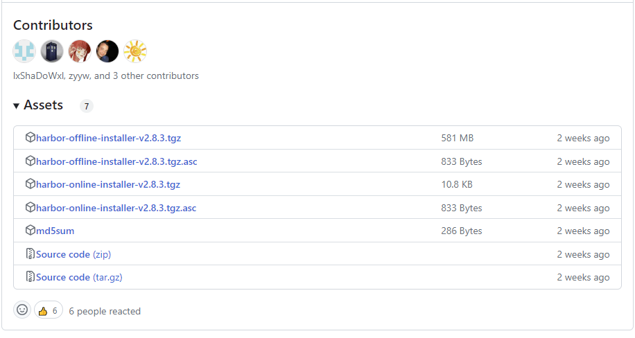
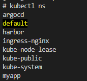

# harbor-install
harborのインストール手順

## 参考
https://tech-mmmm.blogspot.com/2022/12/ossharbor.html

## 環境

```
# uname -r
3.10.0-1160.el7.x86_64  
```

```
# minikube version 
minikube version: v1.21.0
commit: 76d74191d82c47883dc7e1319ef7cebd3e00ee11
```

```
# docker version 
Client: Docker Engine - Community
 Version:           20.10.7
 API version:       1.41
 Go version:        go1.13.15
 Git commit:        f0df350
 Built:             Wed Jun  2 11:58:10 2021
 OS/Arch:           linux/amd64
 Context:           default
 Experimental:      true

Server: Docker Engine - Community
 Engine:
  Version:          20.10.7
  API version:      1.41 (minimum version 1.12)
  Go version:       go1.13.15
  Git commit:       b0f5bc3
  Built:            Wed Jun  2 11:56:35 2021
  OS/Arch:          linux/amd64
  Experimental:     false
 containerd:
  Version:          1.4.6
  GitCommit:        d71fcd7d8303cbf684402823e425e9dd2e99285d
 runc:
  Version:          1.0.0-rc95
  GitCommit:        b9ee9c6314599f1b4a7f497e1f1f856fe433d3b7
 docker-init:
  Version:          0.19.0
  GitCommit:        de40ad0
```

docker compose はインストールされていない
```
# docker compose version
docker: 'compose' is not a docker command.
See 'docker --help'
```

## Docker composeのインストール（yumでdocker-compose-plugin をインストールし手失敗）


~~# dnf install docker-compose-plugin -y~~


~~# dnf install docker-compose-plugin -y~~
~~bash: dnf: コマンドが見つかりませんでした...~~

- yum でインストールした場合、docker-compose のパスの通し方が分からないので一旦アンインストールした


~~# yum install docker-compose-plugin -y~~


~~# docker compose version~~
~~Docker Compose version v2.20.2~~

~~- インストール完了~~

- yumでdocker-compose-plugin をインストールした場合の、アンインストール手順は以下

1. インストールしたパッケージ名を確認
    ```
    # yum list installed | grep docker-compose-plugin
    docker-compose-plugin.x86_64                2.20.2-1.el7               @docker-ce-stable
    ```

1. インストールしたパッケージをアンインストール
    ```
    # yum remove docker-compose-plugin.x86_64
    ```

1. パッケージのアンインストールを確認（以下のコマンドを実行し、何も表示されないことを確認）
    ```
    # yum list installed | grep docker-compose-plugin
    ```

1. 不要な依存関係や設定ファイルが残っている可能性があるため、アンインストール後に不要なファイルや設定を削除する
    ```
    # yum autoremove
    読み込んだプラグイン:fastestmirror, langpacks
    削除対象とマークされたパッケージはありません。
    ```

## Docker composeのインストール（docker-compose-plugin をマニュアルでインストール）

- 以下の資料を参考にして実施
https://docs.docker.jp/compose/install/compose-plugin.html


- 以下のサイトのAssetsにて、最新のダウンロードを確認
https://github.com/docker/compose/releases/

- Assetsから以下を選択
https://github.com/docker/compose/releases/download/v2.20.3/docker-compose-linux-x86_64

- PATH を確認

    ```
    # echo $PATH
    /root/.krew/bin:/root/.vscode-server/bin/6c3e3dba23e8fadc360aed75ce363ba185c49794/bin/remote-cli:/root/.krew/bin:/root/.krew/bin:/usr/local/sbin:/usr/local/bin:/usr/sbin:/usr/bin:/root/bin
    ```

- `/usr/local/bin` にパスが通っているのでインストールコマンドを以下とする

    - ダウンロード先フォルダの存在を確認

    ~~# ll /usr/local/bin/docker/cli-plugins/~~
    ~~ls: /usr/local/bin/docker/cli-plugins/ にアクセスできません: そのようなファイルやディレクトリはありません~~

 
    ~~- ダウンロード先フォルダを作成~~

    ~~# mkdir -p /usr/local/bin/docker/cli-plugins/~~

    ~~- ダウンロード先フォルダの作成を確認~~

    ~~# ll /usr/local/bin/docker/cli-plugins/~~
    ~~合計 0~~

    - インストールコマンド

    ```
    curl -SL https://github.com/docker/compose/releases/download/v2.20.3/docker-compose-linux-x86_64 -o /usr/local/bin/docker-compose
    ```

    - ファイルのダウンロードを確認

    ```
    # ll /usr/local/bin/
    -rw-r--r--. 1 root root 59383631  8月 13 22:54 docker-compose
    ```

    - 実行権限の付与

    ```
    chmod +x /usr/local/bin/docker-compose
    ```

    - 実行権限の付与の確認

    ```
    ll /usr/local/bin/
    -rwxr-xr-x. 1 root root 59383631  8月 13 22:54 docker-compose
    ```

    - 正常にインストールされたかを確認

    ```
    # /usr/local/bin/docker-compose version
    Docker Compose version v2.20.3
    ```


## Docker composeのコマンドの設定


~~- 補完スクリプトを /etc/bash_completion.d/ に置きます。~~

<del> 
~~curl~~
    ~~    -L https://raw.githubusercontent.com/docker/compose/1.29.2/contrib/completion/bash/docker-compose \ ~~　
    ~~    -o /etc/bash_completion.d/docker-compose~~

~~- ターミナルを再読み込みします。ターミナルを閉じて新しいものを開くか、あるいは現在のターミナルで `source ~/.bashrc` コマンドで再読み込みします。~~


~~- 下記ドキュメントによると、今回は、docker-compose を単体ではなく、プラグインでインストールした模様~~
~~https://docs.docker.jp/compose/install/compose-plugin.html~~

~~- この場合、パスを設定する必要がある模様~~

~~- docker-compose-plugin のインストール先は、以下~~
~~# locate docker-compose-plugin~~
~~/var/cache/yum/x86_64/7/docker-ce-stable/packages/docker-compose-plugin-2.19.1-1.el7.x86_64.rpm~~
~~/var/cache/yum/x86_64/7/docker-ce-stable/packages/docker-compose-plugin-2.20.2-1.el7.x86_64.rpm~~

</del>

- 以下の資料を参考にして実施
https://qiita.com/JunkiHiroi/items/3bf722af3e77c73a1625


    - 以下のコマンド入力てして、tabキー押下で docker-compose が表示されることを確認

    ```
    # docker
    docker                         docker-init                    dockerd                        dockerd-rootless.sh
    docker-compose                 docker-proxy                   dockerd-rootless-setuptool.sh 
    ```

## Harborインストール

- 参考にしたサイトに従い、オフラインでインストール

1. 以下のサイトからHarborのインストーラをダウンロードする

    

    - harbor-offline-installer-v2.8.3.tgz をダウンロード

1. インストーラを解凍

    ```
    cd ~
    ```

    ```
    # tar zxvf harbor-offline-installer-v2.8.3.tgz
    ```
    
    ```
    # tar zxvf harbor-offline-installer-v2.8.3.tgz
    harbor/harbor.v2.8.3.tar.gz
    harbor/prepare
    harbor/LICENSE
    harbor/install.sh
    harbor/common.sh
    harbor/harbor.yml.tmpl
    ```

    ```
    # ll ~/harbor/
    ```

    ```
    # ll ~/harbor/
    合計 598680
    -rw-r--r--. 1 root root     11347  7月 27 15:00 LICENSE
    -rw-r--r--. 1 root root      3639  7月 27 15:00 common.sh
    -rw-r--r--. 1 root root 613010641  7月 27 15:01 harbor.v2.8.3.tar.gz
    -rw-r--r--. 1 root root     11736  7月 27 15:00 harbor.yml.tmpl
    -rwxr-xr-x. 1 root root      2725  7月 27 15:00 install.sh
    -rwxr-xr-x. 1 root root      1881  7月 27 15:00 prepare
    ```

1. インストール設定ファイル(YAML)を修正

    ```
    # cd harbor
    ```

    ```
    # cp harbor.yml.tmpl harbor.yml
    ```

    harbor.yml を以下のように修正

    ```
    # diff harbor.yml.tmpl harbor.yml
    5c5,6
    < hostname: reg.mydomain.com
    ---
    > # hostname: reg.mydomain.com
    > hostname: 10.1.1.200
    13c14
    < https:
    ---
    > # https:
    15c16
    <   port: 443
    ---
    > #  port: 443
    17,18c18,19
    <   certificate: /your/certificate/path
    <   private_key: /your/private/key/path
    ---
    > #  certificate: /your/certificate/path
    > #  private_key: /your/private/key/path
    ```


1. インストールスクリプトの実行


    ```
    [root@control-plane ~]
    # cd harbor
    [root@control-plane ~/harbor]
    # ll
    合計 598700
    -rw-r--r--. 1 root root     11347  7月 27 15:00 LICENSE
    drwxr-xr-x. 3 root root        20  8月 13 09:37 common
    -rw-r--r--. 1 root root      3639  7月 27 15:00 common.sh
    -rw-r--r--. 1 root root      5834  8月 13 09:37 docker-compose.yml
    -rw-r--r--. 1 root root 613010641  7月 27 15:01 harbor.v2.8.3.tar.gz
    -rw-r--r--. 1 root root     11764  8月 13 09:32 harbor.yml
    -rw-r--r--. 1 root root     11736  7月 27 15:00 harbor.yml.tmpl
    -rwxr-xr-x. 1 root root      2725  7月 27 15:00 install.sh
    -rwxr-xr-x. 1 root root      1881  7月 27 15:00 prepare
    ```

    ```
    # ./install.sh
    ```

    ```
    [Step 5]: starting Harbor ...
    [+] Running 10/10
    ✔ Network harbor_harbor        Created                                                                                                     0.2s 
    ✔ Container harbor-log         Started                                                                                                     2.5s 
    ✔ Container registryctl        Started                                                                                                    24.8s 
    ✔ Container harbor-portal      Started                                                                                                    25.8s 
    ✔ Container registry           Started                                                                                                    26.1s 
    ✔ Container redis              Started                                                                                                    25.8s 
    ✔ Container harbor-db          Started                                                                                                    26.2s 
    ✔ Container harbor-core        Started                                                                                                    28.0s 
    ✔ Container nginx              Started                                                                                                    29.7s 
    ✔ Container harbor-jobservice  Started                                                                                                    29.7s 
    ✔ ----Harbor has been installed and started successfully.----

    ```

## DockerをHTTP接続に対応させる設定

- Dockerは標準では、コンテナレジストリに対してHTTPSによる接続を行うため、HTTPによる接続をできるよう、/etc/docker/daemon.jsonのファイルを新規作成する。

- 記載しているIPアドレスは、harbor.ymlのhostnameの設定と合わせればよく、IPアドレスまたはFQDNで設定することができる。

    ```
    # ls -l /etc/docker/daemon.json
    -rw-r--r--. 1 root root 71  7月 17 12:13 /etc/docker/daemon.json
    ```

    ```
    # cat  /etc/docker/daemon.json
    {
    "dns": ["8.8.8.8"],
    "insecure-registries": ["172.17.0.1:5000"]
    }
    ```

- ファイルが存在していたため以下のように編集

    ```
    # diff  /etc/docker/daemon.json.org /etc/docker/daemon.json
    3c3
    <   "insecure-registries": ["172.17.0.1:5000"]
    ---
    >   "insecure-registries": ["172.17.0.1:5000", "10.1.1.200"]
    ```

- 設定後は、Docker及びHarborの再起動が必要となるため、以下の通り再起動を行う。

    ```
    # systemctl restart docker
    ```
    ```
    # docker compose down -v
    ```
    ```
    # docker compose up -d
    [+] Running 9/9
    ✔ Container harbor-log         Running                                                                                               0.0s 
    ✔ Container harbor-portal      Running                                                                                               0.0s 
    ✔ Container registryctl        Started                                                                                               0.0s 
    ✔ Container redis              Started                                                                                               0.0s 
    ✔ Container registry           Started                                                                                               0.0s 
    ✔ Container harbor-db          Started                                                                                               0.0s 
    ✔ Container harbor-core        Started                                                                                               0.0s 
    ✔ Container nginx              Started                                                                                               0.0s 
    ✔ Container harbor-jobservice  Started      
    ```

## Web管理画面にログイン

- ユーザ : admin
- 初期パスワード : Harbor12345
- 接続先 : http://10.1.1.200


## 動作確認

- 以下の資料を参考に実施
https://tech-mmmm.blogspot.com/2022/12/ossharbor.html


## おまけ


1. kubens のインストール

    - ここまでの手順では、kubens を使用していなかったが、元の手順ではデフォルト（未指定時）のnammespaceをkubens harbarに設定しているようなので、kubens をインストールする

    - kubectx も併せてインストールする

    以下のサイトを参考にした
    https://qiita.com/prodigy413/items/8db33f731476540e654f

    1. krew 設定

        1. 以下コマンド実行で krew インストール

        ```
        (
        set -x; cd "$(mktemp -d)" &&
        OS="$(uname | tr '[:upper:]' '[:lower:]')" &&
        ARCH="$(uname -m | sed -e 's/x86_64/amd64/' -e 's/\(arm\)\(64\)\?.*/\1\2/' -e 's/aarch64$/arm64/')" &&
        KREW="krew-${OS}_${ARCH}" &&
        curl -fsSLO "https://github.com/kubernetes-sigs/krew/releases/latest/download/${KREW}.tar.gz" &&
        tar zxvf "${KREW}.tar.gz" &&
        ./"${KREW}" install krew
        )
        ```

    1.  PATH追加

        ```
         # vi ~/.bashrc
        ```

        以下を追加
        ```
        export PATH="${KREW_ROOT:-$HOME/.krew}/bin:$PATH"
        ```

        修正内容を確認
        ```
        # cat ~/.bashrc 
        ```

    1. シェルの再起動

        ```
        # exec $SHELL -l
        ```

    1. krewのインストール正否確認

        ```
        # kubectl krew
        ```

        ```
        krew is the kubectl plugin manager.
        You can invoke krew through kubectl: "kubectl krew [command]..."
        ..........
        ```
    1. kubectx のイントール

        ```
        # kubectl krew install ctx
        ```

        - 2023-08-12現在、contextの使い方が分からないため、インストールのみ実施

        - 以下のような警告メッセージが出力されたが、とりあえずこのままとする。

        ```
        # kubectl krew install ctx
        Updated the local copy of plugin index.
        Installing plugin: ctx
        Installed plugin: ctx
        \
        | Use this plugin:
        |      kubectl ctx
        | Documentation:
        |      https://github.com/ahmetb/kubectx
        | Caveats:
        | \
        |  | If fzf is installed on your machine, you can interactively choose
        |  | between the entries using the arrow keys, or by fuzzy searching
        |  | as you type.
        |  | See https://github.com/ahmetb/kubectx for customization and details.
        | /
        /
        WARNING: You installed plugin "ctx" from the krew-index plugin repository.
        These plugins are not audited for security by the Krew maintainers.
        Run them at your own risk.        
        ```

    1. kubens のインストール

        ```
        # kubectl krew install ns
        ```

        - 以下のような警告メッセージが出力されたが、とりあえずこのままとする。

        ```
        # kubectl krew install ns
        Updated the local copy of plugin index.
        Installing plugin: ns
        Installed plugin: ns
        \
        | Use this plugin:
        |      kubectl ns
        | Documentation:
        |      https://github.com/ahmetb/kubectx
        | Caveats:
        | \
        |  | If fzf is installed on your machine, you can interactively choose
        |  | between the entries using the arrow keys, or by fuzzy searching
        |  | as you type.
        | /
        /
        WARNING: You installed plugin "ns" from the krew-index plugin repository.
        These plugins are not audited for security by the Krew maintainers.
        Run them at your own risk.
        ```
        - 正常動作を確認。namespace変更確認

            ※黄色のnamespaceが使用中のnamespace

            

1. namespaceを harbor に設定

    ```
    # kubectl ns kubens
    ```

    以下のメッセージが返ってくればOK
    ```
    Context "minikube" modified.
    Active namespace is "harbor".
    ```

## コンテナイメージをPush

Pushするコンテナイメージに対して、タグの設定を行う。タグは以下の形式で設定する。

```
[HarborのIPアドレスまたはFQDN]/[プロジェクト名]:[タグ名]
```
``````
# docker tag oraclelinux:8.7 10.1.1.200/myproject/oraclelinux:8.7
```

タグを付与したコンテナイメージをPushする。

```
# docker push 10.1.1.200/myproject/oraclelinux:8.7
```

## HarborよりコンテナイメージをPull
HarborよりコンテナイメージをPullする。

```
# docker pull 10.1.1.200/myproject/oraclelinux:8.7
```
```
# docker images | grep oracle
10.1.1.200/myproject/oraclelinux                     8.7             64a9493ed840   4 months ago    230MB
```